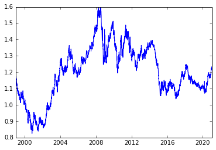
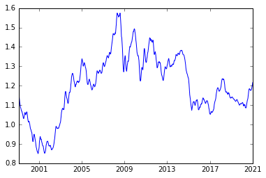
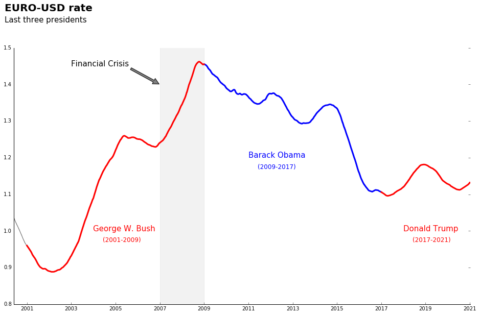

# Exchange Rate of Euro to the Dollar

Data source is the European Central Bank <br/>
Data set is available on [Kaggle](https://www.kaggle.com/lsind18/euro-exchange-daily-rates-19992020)


```python
import pandas as pd
exchange_rates = pd.read_csv('euro-daily-hist_1999_2020.csv')
```


```python
exchange_rates.head()
```


<div>
<style scoped>
    .dataframe tbody tr th:only-of-type {
        vertical-align: middle;
    }

    .dataframe tbody tr th {
        vertical-align: top;
    }

    .dataframe thead th {
        text-align: right;
    }
</style>
<table border="1" class="dataframe">
  <thead>
    <tr style="text-align: right;">
      <th></th>
      <th>Period\Unit:</th>
      <th>[Australian dollar ]</th>
      <th>[Bulgarian lev ]</th>
      <th>[Brazilian real ]</th>
      <th>[Canadian dollar ]</th>
      <th>[Swiss franc ]</th>
      <th>[Chinese yuan renminbi ]</th>
      <th>[Cypriot pound ]</th>
      <th>[Czech koruna ]</th>
      <th>[Danish krone ]</th>
      <th>...</th>
      <th>[Romanian leu ]</th>
      <th>[Russian rouble ]</th>
      <th>[Swedish krona ]</th>
      <th>[Singapore dollar ]</th>
      <th>[Slovenian tolar ]</th>
      <th>[Slovak koruna ]</th>
      <th>[Thai baht ]</th>
      <th>[Turkish lira ]</th>
      <th>[US dollar ]</th>
      <th>[South African rand ]</th>
    </tr>
  </thead>
  <tbody>
    <tr>
      <th>0</th>
      <td>2021-01-08</td>
      <td>1.5758</td>
      <td>1.9558</td>
      <td>6.5748</td>
      <td>1.5543</td>
      <td>1.0827</td>
      <td>7.9184</td>
      <td>NaN</td>
      <td>26.163</td>
      <td>7.4369</td>
      <td>...</td>
      <td>4.8708</td>
      <td>90.8000</td>
      <td>10.0510</td>
      <td>1.6228</td>
      <td>NaN</td>
      <td>NaN</td>
      <td>36.8480</td>
      <td>9.0146</td>
      <td>1.2250</td>
      <td>18.7212</td>
    </tr>
    <tr>
      <th>1</th>
      <td>2021-01-07</td>
      <td>1.5836</td>
      <td>1.9558</td>
      <td>6.5172</td>
      <td>1.5601</td>
      <td>1.0833</td>
      <td>7.9392</td>
      <td>NaN</td>
      <td>26.147</td>
      <td>7.4392</td>
      <td>...</td>
      <td>4.8712</td>
      <td>91.2000</td>
      <td>10.0575</td>
      <td>1.6253</td>
      <td>NaN</td>
      <td>NaN</td>
      <td>36.8590</td>
      <td>8.9987</td>
      <td>1.2276</td>
      <td>18.7919</td>
    </tr>
    <tr>
      <th>2</th>
      <td>2021-01-06</td>
      <td>1.5824</td>
      <td>1.9558</td>
      <td>6.5119</td>
      <td>1.5640</td>
      <td>1.0821</td>
      <td>7.9653</td>
      <td>NaN</td>
      <td>26.145</td>
      <td>7.4393</td>
      <td>...</td>
      <td>4.8720</td>
      <td>90.8175</td>
      <td>10.0653</td>
      <td>1.6246</td>
      <td>NaN</td>
      <td>NaN</td>
      <td>36.9210</td>
      <td>9.0554</td>
      <td>1.2338</td>
      <td>18.5123</td>
    </tr>
    <tr>
      <th>3</th>
      <td>2021-01-05</td>
      <td>1.5927</td>
      <td>1.9558</td>
      <td>6.5517</td>
      <td>1.5651</td>
      <td>1.0803</td>
      <td>7.9315</td>
      <td>NaN</td>
      <td>26.227</td>
      <td>7.4387</td>
      <td>...</td>
      <td>4.8721</td>
      <td>91.6715</td>
      <td>10.0570</td>
      <td>1.6180</td>
      <td>NaN</td>
      <td>NaN</td>
      <td>36.7760</td>
      <td>9.0694</td>
      <td>1.2271</td>
      <td>18.4194</td>
    </tr>
    <tr>
      <th>4</th>
      <td>2021-01-04</td>
      <td>1.5928</td>
      <td>1.9558</td>
      <td>6.3241</td>
      <td>1.5621</td>
      <td>1.0811</td>
      <td>7.9484</td>
      <td>NaN</td>
      <td>26.141</td>
      <td>7.4379</td>
      <td>...</td>
      <td>4.8713</td>
      <td>90.3420</td>
      <td>10.0895</td>
      <td>1.6198</td>
      <td>NaN</td>
      <td>NaN</td>
      <td>36.7280</td>
      <td>9.0579</td>
      <td>1.2296</td>
      <td>17.9214</td>
    </tr>
  </tbody>
</table>
<p>5 rows × 41 columns</p>
</div>


```python
exchange_rates.tail()
```


<div>
<style scoped>
    .dataframe tbody tr th:only-of-type {
        vertical-align: middle;
    }

    .dataframe tbody tr th {
        vertical-align: top;
    }

    .dataframe thead th {
        text-align: right;
    }
</style>
<table border="1" class="dataframe">
  <thead>
    <tr style="text-align: right;">
      <th></th>
      <th>Period\Unit:</th>
      <th>[Australian dollar ]</th>
      <th>[Bulgarian lev ]</th>
      <th>[Brazilian real ]</th>
      <th>[Canadian dollar ]</th>
      <th>[Swiss franc ]</th>
      <th>[Chinese yuan renminbi ]</th>
      <th>[Cypriot pound ]</th>
      <th>[Czech koruna ]</th>
      <th>[Danish krone ]</th>
      <th>...</th>
      <th>[Romanian leu ]</th>
      <th>[Russian rouble ]</th>
      <th>[Swedish krona ]</th>
      <th>[Singapore dollar ]</th>
      <th>[Slovenian tolar ]</th>
      <th>[Slovak koruna ]</th>
      <th>[Thai baht ]</th>
      <th>[Turkish lira ]</th>
      <th>[US dollar ]</th>
      <th>[South African rand ]</th>
    </tr>
  </thead>
  <tbody>
    <tr>
      <th>5694</th>
      <td>1999-01-08</td>
      <td>1.8406</td>
      <td>NaN</td>
      <td>NaN</td>
      <td>1.7643</td>
      <td>1.6138</td>
      <td>NaN</td>
      <td>0.58187</td>
      <td>34.938</td>
      <td>7.4433</td>
      <td>...</td>
      <td>1.3143</td>
      <td>27.2075</td>
      <td>9.1650</td>
      <td>1.9537</td>
      <td>188.8400</td>
      <td>42.560</td>
      <td>42.5590</td>
      <td>0.3718</td>
      <td>1.1659</td>
      <td>6.7855</td>
    </tr>
    <tr>
      <th>5695</th>
      <td>1999-01-07</td>
      <td>1.8474</td>
      <td>NaN</td>
      <td>NaN</td>
      <td>1.7602</td>
      <td>1.6165</td>
      <td>NaN</td>
      <td>0.58187</td>
      <td>34.886</td>
      <td>7.4431</td>
      <td>...</td>
      <td>1.3092</td>
      <td>26.9876</td>
      <td>9.1800</td>
      <td>1.9436</td>
      <td>188.8000</td>
      <td>42.765</td>
      <td>42.1678</td>
      <td>0.3701</td>
      <td>1.1632</td>
      <td>6.8283</td>
    </tr>
    <tr>
      <th>5696</th>
      <td>1999-01-06</td>
      <td>1.8820</td>
      <td>NaN</td>
      <td>NaN</td>
      <td>1.7711</td>
      <td>1.6116</td>
      <td>NaN</td>
      <td>0.58200</td>
      <td>34.850</td>
      <td>7.4452</td>
      <td>...</td>
      <td>1.3168</td>
      <td>27.4315</td>
      <td>9.3050</td>
      <td>1.9699</td>
      <td>188.7000</td>
      <td>42.778</td>
      <td>42.6949</td>
      <td>0.3722</td>
      <td>1.1743</td>
      <td>6.7307</td>
    </tr>
    <tr>
      <th>5697</th>
      <td>1999-01-05</td>
      <td>1.8944</td>
      <td>NaN</td>
      <td>NaN</td>
      <td>1.7965</td>
      <td>1.6123</td>
      <td>NaN</td>
      <td>0.58230</td>
      <td>34.917</td>
      <td>7.4495</td>
      <td>...</td>
      <td>1.3168</td>
      <td>26.5876</td>
      <td>9.4025</td>
      <td>1.9655</td>
      <td>188.7750</td>
      <td>42.848</td>
      <td>42.5048</td>
      <td>0.3728</td>
      <td>1.1790</td>
      <td>6.7975</td>
    </tr>
    <tr>
      <th>5698</th>
      <td>1999-01-04</td>
      <td>1.9100</td>
      <td>NaN</td>
      <td>NaN</td>
      <td>1.8004</td>
      <td>1.6168</td>
      <td>NaN</td>
      <td>0.58231</td>
      <td>35.107</td>
      <td>7.4501</td>
      <td>...</td>
      <td>1.3111</td>
      <td>25.2875</td>
      <td>9.4696</td>
      <td>1.9554</td>
      <td>189.0450</td>
      <td>42.991</td>
      <td>42.6799</td>
      <td>0.3723</td>
      <td>1.1789</td>
      <td>6.9358</td>
    </tr>
  </tbody>
</table>
<p>5 rows × 41 columns</p>
</div>


```python
exchange_rates.info()
```

    <class 'pandas.core.frame.DataFrame'>
    RangeIndex: 5699 entries, 0 to 5698
    Data columns (total 41 columns):
    Period\Unit:                5699 non-null object
    [Australian dollar ]        5699 non-null object
    [Bulgarian lev ]            5297 non-null object
    [Brazilian real ]           5431 non-null object
    [Canadian dollar ]          5699 non-null object
    [Swiss franc ]              5699 non-null object
    [Chinese yuan renminbi ]    5431 non-null object
    [Cypriot pound ]            2346 non-null object
    [Czech koruna ]             5699 non-null object
    [Danish krone ]             5699 non-null object
    [Estonian kroon ]           3130 non-null object
    [UK pound sterling ]        5699 non-null object
    [Greek drachma ]            520 non-null object
    [Hong Kong dollar ]         5699 non-null object
    [Croatian kuna ]            5431 non-null object
    [Hungarian forint ]         5699 non-null object
    [Indonesian rupiah ]        5699 non-null object
    [Israeli shekel ]           5431 non-null object
    [Indian rupee ]             5431 non-null object
    [Iceland krona ]            3292 non-null float64
    [Japanese yen ]             5699 non-null object
    [Korean won ]               5699 non-null object
    [Lithuanian litas ]         4159 non-null object
    [Latvian lats ]             3904 non-null object
    [Maltese lira ]             2346 non-null object
    [Mexican peso ]             5699 non-null object
    [Malaysian ringgit ]        5699 non-null object
    [Norwegian krone ]          5699 non-null object
    [New Zealand dollar ]       5699 non-null object
    [Philippine peso ]          5699 non-null object
    [Polish zloty ]             5699 non-null object
    [Romanian leu ]             5637 non-null float64
    [Russian rouble ]           5699 non-null object
    [Swedish krona ]            5699 non-null object
    [Singapore dollar ]         5699 non-null object
    [Slovenian tolar ]          2085 non-null object
    [Slovak koruna ]            2608 non-null object
    [Thai baht ]                5699 non-null object
    [Turkish lira ]             5637 non-null float64
    [US dollar ]                5699 non-null object
    [South African rand ]       5699 non-null object
    dtypes: float64(3), object(38)
    memory usage: 1.8+ MB


```python
exchange_rates.rename(columns={'[US dollar ]': 'US_dollar',
                               'Period\\Unit:': 'Time'}, 
                      inplace=True)
```


```python
exchange_rates['Time'] = pd.to_datetime(exchange_rates['Time'])
```


```python
exchange_rates.sort_values('Time', inplace=True)
```


```python
euro_to_dollar = exchange_rates[['Time', 'US_dollar']]
```


```python
euro_to_dollar['US_dollar'].value_counts()
```


    -         62
    1.2276     9
    1.1215     8
    1.1305     7
    1.2713     6
    1.1268     6
    1.3532     6
    1.0867     6
    1.1218     6
    1.3086     6
    1.1346     6
    1.1797     6
    1.3373     6
    1.0888     6
    1.1193     6
    1.3260     5
    1.1354     5
    1.0592     5
    1.3596     5
    1.3035     5
    1.0737     5
    1.1168     5
    1.1221     5
    1.1154     5
    1.3615     5
    1.1146     5
    0.8803     5
    1.2737     5
    1.3588     5
    1.2219     5
              ..
    1.0998     1
    1.3139     1
    1.3061     1
    1.0869     1
    1.1211     1
    1.1751     1
    1.5764     1
    1.3682     1
    1.3692     1
    1.4647     1
    1.2578     1
    1.4650     1
    1.4690     1
    1.0958     1
    1.2787     1
    1.0340     1
    1.1721     1
    1.2137     1
    1.1043     1
    0.9687     1
    0.8531     1
    0.8773     1
    1.3779     1
    1.3681     1
    1.1165     1
    1.2972     1
    1.1793     1
    1.2200     1
    1.4473     1
    1.2536     1
    Name: US_dollar, Length: 3528, dtype: int64


```python
euro_to_dollar = euro_to_dollar[euro_to_dollar['US_dollar'] != '-']
```


```python
euro_to_dollar['US_dollar'] = pd.to_numeric(euro_to_dollar['US_dollar'])                                   
```


```python
euro_to_dollar.info()
```

    <class 'pandas.core.frame.DataFrame'>
    Int64Index: 5637 entries, 5698 to 0
    Data columns (total 2 columns):
    Time         5637 non-null datetime64[ns]
    US_dollar    5637 non-null float64
    dtypes: datetime64[ns](1), float64(1)
    memory usage: 132.1 KB


```python
import matplotlib.pyplot as plt
```


```python
%matplotlib inline
```


```python
plt.plot(euro_to_dollar['Time'],
        euro_to_dollar['US_dollar'])
plt.show()
```





```python
euro_to_dollar['rolling_mean'] = euro_to_dollar['US_dollar'].rolling(30).mean()
```


```python
plt.plot(euro_to_dollar['Time'],
        euro_to_dollar['rolling_mean'])
plt.show()
```





```python
import matplotlib.style as style
style.available
```


    ['seaborn-colorblind',
     'seaborn-dark-palette',
     'classic',
     'seaborn-dark',
     'seaborn-whitegrid',
     'seaborn-pastel',
     'seaborn-notebook',
     'seaborn-deep',
     'seaborn-poster',
     'fivethirtyeight',
     'seaborn-talk',
     'seaborn-ticks',
     'ggplot',
     'grayscale',
     'seaborn-paper',
     'dark_background',
     'seaborn-muted',
     'seaborn-bright',
     'seaborn-white',
     'bmh',
     'seaborn-darkgrid']


```python
euro_to_dollar['rolling_mean_365'] = euro_to_dollar['US_dollar'].rolling(365).mean()
```


```python
import datetime
fig, ax = plt.subplots(figsize=(16,9))
ax.plot(euro_to_dollar['Time'], euro_to_dollar['rolling_mean_365'], c='grey')
bush = euro_to_dollar[(euro_to_dollar['Time'] >= datetime.datetime(2001, 1, 1)) &
        (euro_to_dollar['Time'] < datetime.datetime(2009, 1, 1))]
obama = euro_to_dollar[(euro_to_dollar['Time'] >= datetime.datetime(2009, 1, 1)) &
        (euro_to_dollar['Time'] < datetime.datetime(2017, 1, 1))]
trump = euro_to_dollar[(euro_to_dollar['Time'] >= datetime.datetime(2017, 1, 1)) &
        (euro_to_dollar['Time'] < datetime.datetime(2021, 1, 1))]
ax.plot(euro_to_dollar['Time'], euro_to_dollar['rolling_mean_365'], c='grey')
ax.plot(obama['Time'], obama['rolling_mean_365'], c='blue', lw=3.0)
ax.plot(bush['Time'], bush['rolling_mean_365'], c='red', lw=3.0)
ax.plot(trump['Time'], trump['rolling_mean_365'], c='red', lw=3.0)
ax.text(x=datetime.datetime(2000,1,1), y=1.6, s='EURO-USD rate', size=20, weight='bold')
ax.text(x=datetime.datetime(2000,1,1), y=1.57, s='Last three presidents', size=15)
ax.text(x=datetime.datetime(2004,1,1), y=1.00, s='George W. Bush', color='red', size=15)
ax.text(x=datetime.datetime(2004,6,1), y=0.97, s='(2001-2009)', color='red', size=12)
ax.text(x=datetime.datetime(2011,1,1), y=1.20, s='Barack Obama', color='blue', size=15)
ax.text(x=datetime.datetime(2011,6,1), y=1.17, s='(2009-2017)', color='blue', size=12)
ax.text(x=datetime.datetime(2018,1,1), y=1.00, s='Donald Trump', color='red', size=15)
ax.text(x=datetime.datetime(2018,6,1), y=0.97, s='(2017-2021)', color='red', size=12)
ax.spines['top'].set_visible(False)
ax.spines['right'].set_visible(False)
ax.tick_params(left=False, top=False)
ax.axvspan(xmin=datetime.datetime(2007,1,1), xmax=datetime.datetime(2009,1,1), 
           ymin=0, ymax=1.5,
           color='gray',
           alpha=0.1)
ax.annotate(s='Financial Crisis', 
            xy=(datetime.datetime(2007,1,1), 1.4), 
            xytext=(datetime.datetime(2003,1,1), 1.45),
            arrowprops=dict(facecolor='grey', shrink=0.02),
            size=15)
plt.plot()

```


    []





```python

```
